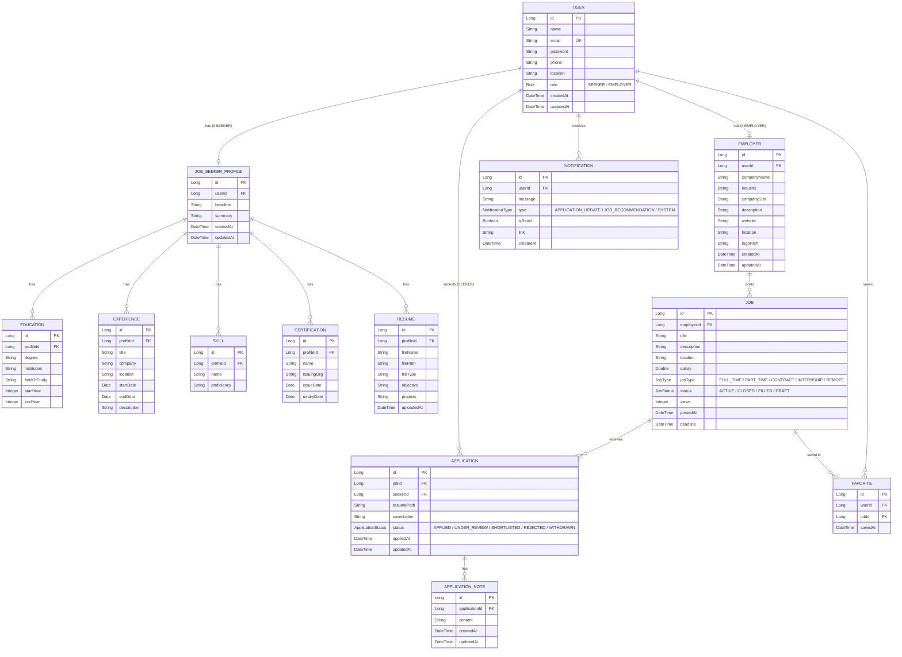

# RevHire — Entity Relationship Diagram

## ER Diagram



```
USER → JOB_SEEKER_PROFILE : One-to-One (optional) because a user can have 0 or 1 job seeker profile.

USER → EMPLOYER : One-to-One (optional) because a user can have 0 or 1 employer account.

JOB_SEEKER_PROFILE → EDUCATION : One-to-Many because a job seeker profile can have multiple education records.

JOB_SEEKER_PROFILE → EXPERIENCE : One-to-Many because a job seeker profile can have multiple experiences.

JOB_SEEKER_PROFILE → SKILL : One-to-Many because a job seeker profile can have multiple skills.

JOB_SEEKER_PROFILE → CERTIFICATION : One-to-Many because a job seeker profile can have multiple certifications.

JOB_SEEKER_PROFILE → RESUME : One-to-Many because a job seeker profile can have multiple resumes.

EMPLOYER → JOB : One-to-Many because an employer can post multiple jobs.

JOB → APPLICATION : One-to-Many because one job can receive multiple applications.

USER → APPLICATION : One-to-Many because a user can apply to multiple jobs.

APPLICATION → APPLICATION_NOTE : One-to-Many because an application can have multiple notes.

USER → FAVORITE : One-to-Many because a user can save multiple jobs.

JOB → FAVORITE : One-to-Many because a job can be saved by multiple users.

USER → NOTIFICATION : One-to-Many because a user can receive multiple notifications.
```


## Table Summary

| # | Table | Owner | Module |
|---|-------|-------|--------|
| 1 | User | Ashwathy | Auth |
| 2 | JobSeekerProfile | Likhita | Profile |
| 3 | Education | Likhita | Profile |
| 4 | Experience | Likhita | Profile |
| 5 | Skill | Likhita | Profile |
| 6 | Certification | Likhita | Profile |
| 7 | Resume | Likhita | Profile |
| 8 | Employer | Chaitanya | Job |
| 9 | Job | Chaitanya | Job |
| 10 | Application | Shilpa | Application |
| 11 | Favorite | Shilpa | Application |
| 12 | ApplicationNote | Harika | Dashboard |
| 13 | Notification | Kunal | Notification |
